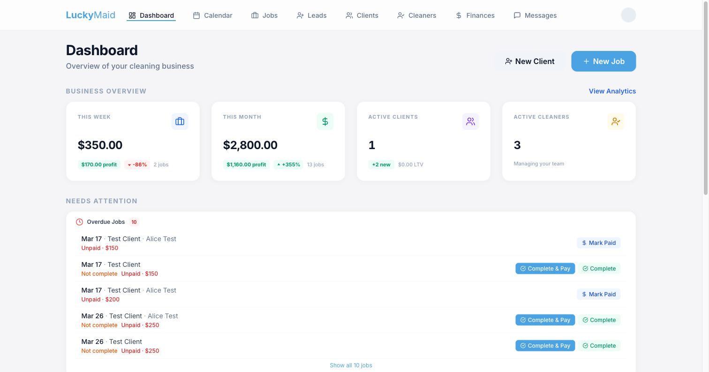
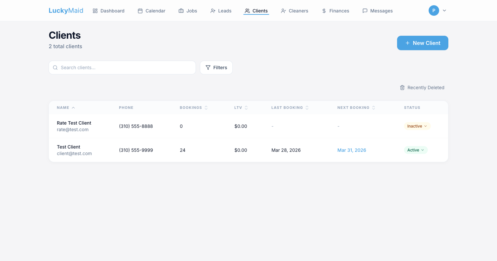
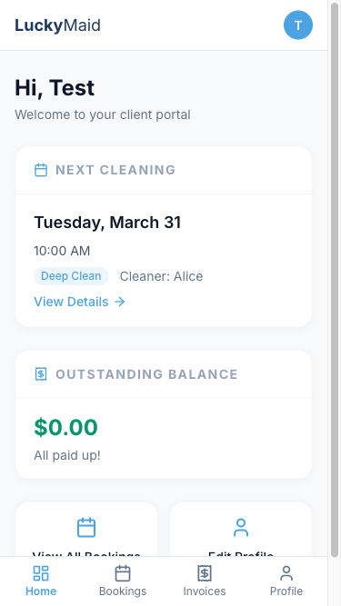

# TidyCo CRM (LuckyMaid)

A production CRM for a cleaning business, built from scratch and running live at [luckymaid.com](https://luckymaid.com). It replaced off-the-shelf tools (Jobber, ZenMaid, BookingKoala) with a custom platform covering the entire operation — from lead capture to payroll.

> **Note:** The source code is in a private repository (it runs a live business). This repo is a showcase — happy to do a code walkthrough on request. **1,480+ commits** of iterative development.

## Screenshots

*All screenshots use seeded test data.*

| Admin dashboard | Clients |
|---|---|
|  |  |

## What it does

**Admin dashboard**
- Business overview: weekly/monthly revenue, profit, job counts, "needs attention" queue
- Calendar & scheduling with cleaner availability, conflict detection, auto-assignment
- Jobs: one-off + recurring series, reschedule/cancel flows, apply-changes-to-future-jobs
- Leads pipeline (drag-and-drop kanban), clients, cleaners with rate overrides & weekly schedules
- Finances: invoices (PDF generation), quotes, payroll, P&L overview
- Messaging hub and inbound email parsing
- Analytics with charts, time-off management

**Client portal**
- Self-serve bookings (view, reschedule), invoices, balance, profile — desktop + mobile
- Magic-link invites from the admin side

**Public site**
- Online booking flow, SEO/comparison landing pages, blog, profit calculator for cleaning businesses

**AI & automation**
- Claude-powered chat assistant (Anthropic SDK)
- Scheduled jobs via Vercel crons (reminders, recurring-job generation)

## Stack

Next.js 14 (App Router) · TypeScript · Supabase (Postgres + Auth) · Stripe & Square payments · Anthropic Claude API · Google APIs · Tailwind CSS · Recharts · dnd-kit · Sentry · PostHog · Vercel

## Why it exists

Built to run my own cleaning business day-to-day, with the architecture kept white-label so it can be offered as SaaS to other cleaning companies. Every feature exists because the business needed it.
